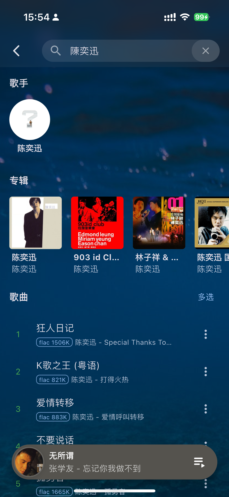
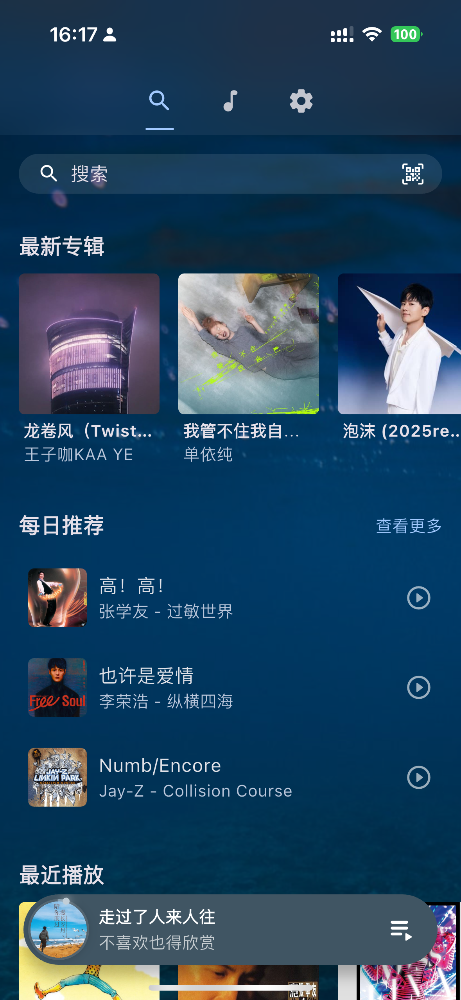
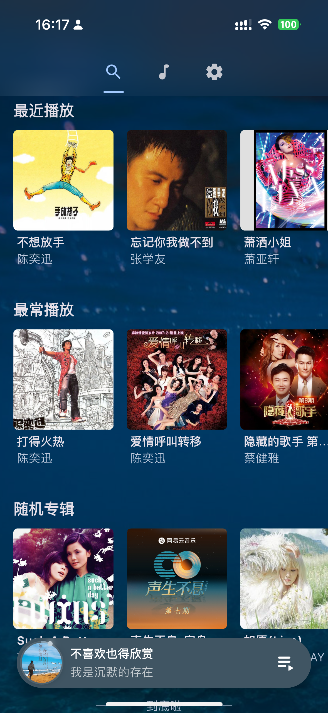
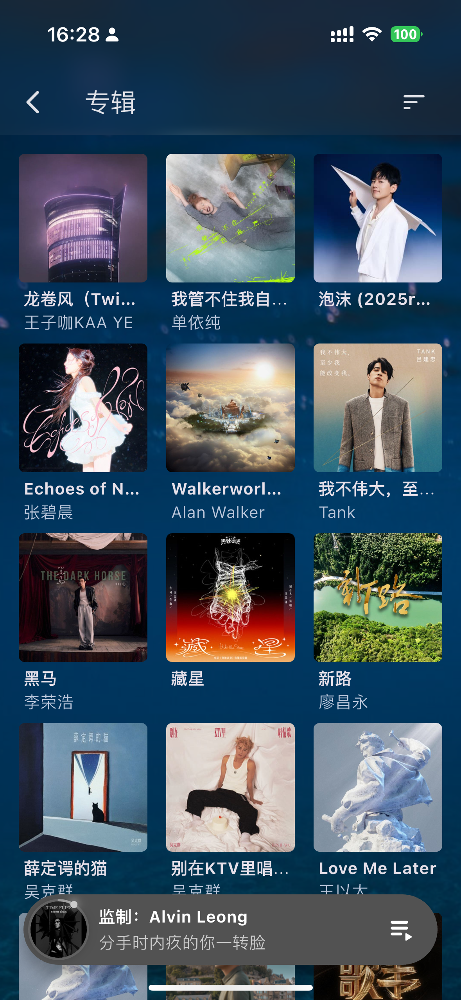
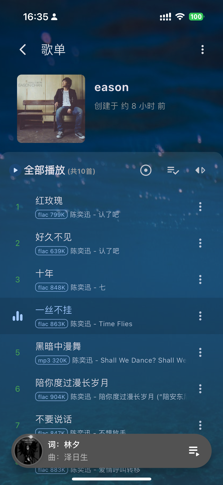
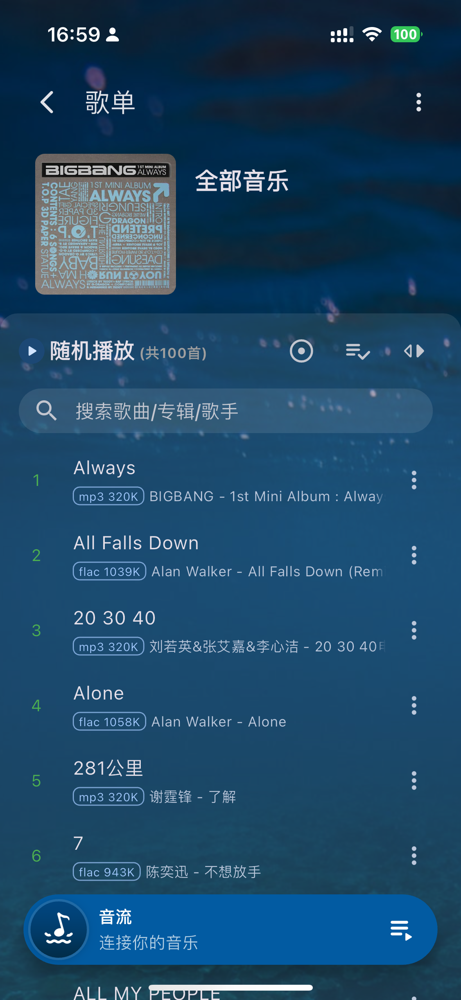

# QM-Music 🎵
[中文](README.md) | [English](README.en.md)
🎧☁️ Your Private Music Service
[](https://hub.docker.com/r/qmmusic/qm-music)
[](https://www.apache.org/licenses/LICENSE-2.0)

**QM-Music** 是一个基于 Subsonic 构建的轻量级私有云音乐服务器，专为音乐爱好者设计的轻量级高性能解决方案。支持 Docker 一键部署，完美兼容 Subsonic 生态客户端（如音流/Audinaut），让您随时随地安全访问个人音乐库。
<div style="display: flex; gap: 5px;">
  
  
  
  
  
  
  
  
  
</div>


## 🌟 核心特性

- 🐳 **Docker 容器化部署** - 快速启动，零环境依赖
- 🌱 **轻量级部署** - 仅需约150MB内存占用，低资源消耗
- 🎧 **Subsonic 协议兼容** - 可在支持 subsonic api 的客户端连接使用
- ⚡ **高性能媒体服务** - 低延迟流媒体传输
- 🔄 **智能转码支持** - 按需开启 libmp3lame/acc 转码节省流量
- 📁 **多格式支持** - 全面兼容 MP3/FLAC/AAC/WAV 等格式
- 🔒 **私有化部署** - 完全掌控您的音乐数据

## 🚀 快速开始

### 基本部署
#### docker run
```bash
docker run -d \
  --name qm-music \
  -p 6688:6688 \
  -v [host_music_file_path]:/data/qm-music/music_dir \
  -v [host_path_db_path]:/data/qm-music/db \
  -v [host_path_cache_path]:/data/qm-music/cache \
  -e QM_FFMPEG_ENABLE=true \
  -e TZ=Asia/Shanghai \
  -e QM_SPOTIFY_ENABLE=false \
  -e QM_SPOTIFY_CLIENT_ID="" \
  -e QM_SPOTIFY_CLIENT_SECRET="" \
  -e QM_LASTFM_ENABLE=false \
  -e QM_LASTFM_API_KEY="" \
  --restart unless-stopped \
  qmmusic/qm-music:latest
```
#### docker compose
```bash
version: '3'

services:
  qm-music:
    container_name: qm-music
    image: qmmusic/qm-music:latest
    ports:
      - "6688:6688"
    volumes:
      - [host_music_file_path]:/data/qm-music/music_dir
      - [host_path_db_path]:/data/qm-music/db
      - [host_path_cache_path]:/data/qm-music/cache 
    environment:
      - QM_FFMPEG_ENABLE=true
      - TZ=Asia/Shanghai
      - QM_SPOTIFY_ENABLE=false
      - QM_SPOTIFY_CLIENT_ID=""
      - QM_SPOTIFY_CLIENT_SECRET=""
      - QM_LASTFM_ENABLE=false
      - QM_LASTFM_API_KEY="" 
    restart: unless-stopped
```

### ⚙️ 配置说明
- **环境变量**  
  - `QM_FFMPEG_ENABLE=true` 启用智能音频转码（推荐在户外使用的用户开启），支持按网络状况自动切换 libmp3lame/acc 编码，有效节省流量消耗（默认关闭）
  - `TZ=Asia/Shanghai` 请务必根据所在地区设置
  - `QM_SPOTIFY_ENABLE=false` 开启后，可以获得更多元数据支持 [](https://developer.spotify.com/)
  - `QM_SPOTIFY_CLIENT_ID` 
  - `QM_SPOTIFY_CLIENT_SECRET` 
  - `QM_LASTFM_ENABLE=false` 开启后，可以获得更多元数据支持  [](https://www.last.fm/api)
  - `QM_LASTFM_API_KEY` 
- **卷挂载**  
  - `/data/qm-music/music_dir`：音乐文件存储目录
  - `/data/qm-music/db`：数据库及元数据存储目录（请勿存放其他文件）
  - `/data/qm-music/cache`: 缓存文件
### 🖥️ 初始化使用
1. 访问 `http://[Server IP]:[Port]` 进入管理界面
2. 使用默认凭证登录：  
   **用户名**：`admin`  
   **密码**：`admin`
3. 在首页立即更改默认密码
4. 前往「曲库管理」点击【刷新曲库】按钮
5. 等待曲目元数据解析完成（可通过日志查看进度）
6. 在客户端应用（音流/Substreamer等）使用以下连接参数：
   ```properties
   服务器地址: http://[服务器IP]:6688
   账户: 修改后的管理员账号
   密码: 修改后的管理员密码
   ```

## 📜 开源协议
本项目基于 [Apache License 2.0](https://www.apache.org/licenses/LICENSE-2.0) 开源协议发布，您可以：
- 二次开发时需保留原始版权声明
- 修改后的衍生版本需做明显变更说明
- 不提供任何明示或暗示的担保

完整协议内容请查看 [LICENSE](LICENSE) 文件，使用即表示您同意协议条款。
   
## 📋 功能概览

### 🚀 核心功能
- **Docker 容器化部署** - 一键启动，轻量无依赖
- **Subsonic 协议全兼容** - 完美适配音流/Substreamer 等客户端
- **智能音频转码** - 动态切换 libmp3lame/acc 编码（按需启用）,节省带宽流量
- **多格式支持** - MP3/FLAC/AAC/WAV 等主流格式全覆盖
- **低资源占用** - 运行内存仅需约 150MB

### 🎧 用户体验
- **多用户体系** - 独立账号系统与权限管理
- **个性化歌单** - 支持创建/管理自定义播放列表
- **收藏与喜欢** - 实时同步的收藏夹功能
- **歌词同步** - 智能匹配本地与在线歌词资源

### 🗂️ 音乐管理
- **自动化曲库** - 定时监测音乐目录变动，自动刷新元数据
- **高效元数据解析** - 精准识别 ID3 标签与专辑信息
- **结构化展示** - 专辑/艺术家/流派多维分类浏览
- **云端播放统计** - 记录播放历史与用户偏好

### 🔍 探索发现
- **全局搜索** - 支持歌曲/专辑/艺术家关键词检索
- **智能推荐** - 基于风格的相似歌曲与歌手推荐
- **流派分类** - 按音乐风格快速筛选曲目

### 🌐 生态扩展
[](https://developer.spotify.com/)
[](https://www.last.fm/api)

### ⏭️ 开发路线图
#### 基础设施
- [ ] 支持外置数据库

#### 客户端生态
- [ ] 跨平台客户端开发
- [ ] Web 播放器功能增强

#### 质量保障
- [ ] 单元测试覆盖率提升
